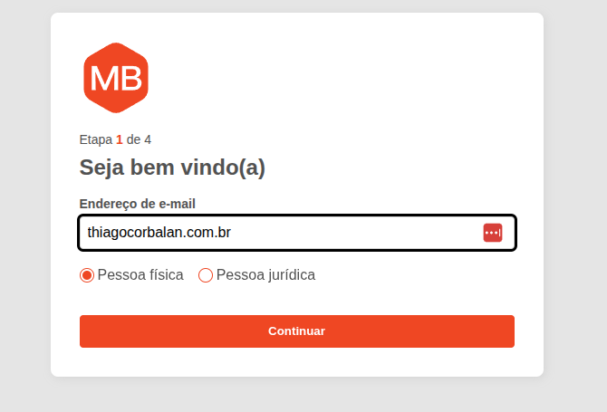

Desafio Frontend para o Mercardo Bitcoin (MB)



## Requisitos técnicos do desafio do MB

-   [x] VueJS 3 (via composition API com `<script setup>` + Vite) / Javascript Vanilla (não utilize Typescript)
-   [x] Não é necessário utilizar Vue Router ou frameworks do tipo
-   [x] Não utilize frameworks de Store/Gerenciamento de estado, dê preferência a recursos nativos da framework Vue ou do Javascript Vanilla
-   [x] Não utilize frameworks para requisições HTTP como Axios e similares, dê preferência ao fetch nativo
-   [x] Não utilize ferramentas de IA para gerar o código, queremos entender como você escreve o código, pensa e desenvolve as soluções. Código gerado por IA pode atrapalhar a análise da sua capacidade técnica.
-   [x] CSS/SASS desenvolvidos por você apenas (não utilize Tailwind, Vuetify ou outras frameworks de estilo, queremos entender como você estrutura classes e seus nomes, estilos, elementos e nomenclatura das variáveis)
-   [x] Performance no client-side é importante, leve isso em consideração ao construir sua solução, tanto em download dos assets, bem como na execução do código e uso de recursos de processamento e memória.
-   [x] NodeJS com Express para servir o conteúdo e as APIs (com modo "mockup") descritos abaixo na sessão Requisitos técnicos para o servidor NodeJS
-   [x] Utilize npm para gerenciamento e instalação de dependências e scripts necessários

### O que fiz a mais

-   [x] Página 404
-   [x] Fluxo completo do cadastro com validação padrão do HTML
-   [x] Implementação de algumas técnicas de a11y
-   [x] Testes e2e, unidade e algumas coisas de componente
-   [x] Execução do projeto via Docker, Docker-compose e Makefile
-   [x] Uma pequena melhora no layout sugerido no desafio.

## Subindo o projeto 🚀

1. Via terminal

    ```bash
    # na pasta do app, rodar:
    npm run serve

    # na pasta da api, rodar:
    npm start
    ```

1. Via Docker

    ```bash
    docker network create --driver bridge mb && docker compose up
    ```

1. Via Makefile
    ```bash
    make start
    ```

## Rodando os testes 🧪

Ambos os projetos foram desenvolvidos testes.

### API

```bash
npm run test
```

### APP

```bash
npm run test:unit # Para testes de unidade (componentes e utils)
```

```bash
npm run test:e2e # Para os testes de e2e do fluxo completo
```

> Obs. Após rodar o comando do teste e2e acima, vai abrir uma janela listando os arquivos, clicar no link **"Run 2 integration specs"** para executar todos os testes e2e.

---

### Para visualizar o projeto acesse: http://localhost:8080/registration
